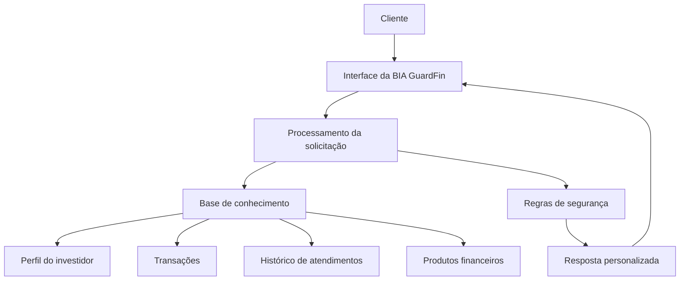

# 🤖 Agente Financeiro Inteligente com IA Generativa

```markdown
# BIA GuardFin

Agente financeiro inteligente desenvolvido com Inteligência Artificial Generativa para apoiar clientes na organização financeira, análise de gastos e tomada de decisões mais conscientes.

A solução foi criada como um protótipo funcional, combinando documentação de produto, base de conhecimento, engenharia de prompts, dados financeiros simulados e uma interface interativa.

---

## Visão geral

A BIA GuardFin atua como uma assistente financeira consultiva. Em vez de apenas responder perguntas, ela analisa o contexto do cliente e fornece orientações personalizadas com base em:

- Perfil do investidor
- Histórico de transações
- Histórico de atendimentos
- Produtos e serviços financeiros disponíveis
- Regras de segurança e confiabilidade

O projeto utiliza exclusivamente dados simulados, evitando a exposição de informações financeiras reais.

---

## Problema

Muitas pessoas têm dificuldade para:

- Entender seus próprios hábitos de consumo
- Identificar gastos recorrentes ou excessivos
- Organizar o orçamento mensal
- Definir objetivos financeiros
- Escolher produtos compatíveis com seu perfil
- Transformar dados financeiros em decisões práticas

A BIA GuardFin foi criada para tornar essa análise mais simples, clara e personalizada.

---

## Objetivo da solução

A BIA GuardFin tem como objetivos:

1. Interpretar informações financeiras do cliente.
2. Identificar padrões de comportamento e consumo.
3. Apresentar insights de forma simples e objetiva.
4. Sugerir ações compatíveis com o perfil do cliente.
5. Apoiar o planejamento de metas financeiras.
6. Reduzir respostas genéricas ou sem fundamento.
7. Evitar recomendações incompatíveis com o perfil de risco.

> A BIA GuardFin é uma ferramenta de apoio e não substitui a orientação de um profissional financeiro.

---

## Principais capacidades

### Análise financeira

- Avaliação de receitas e despesas
- Identificação de categorias com maior consumo
- Detecção de gastos recorrentes
- Comparação entre hábitos financeiros
- Geração de insights sobre o comportamento do cliente

### Personalização

As respostas consideram o contexto individual do cliente, incluindo:

- Perfil conservador, moderado ou arrojado
- Objetivos financeiros
- Preferências de investimento
- Histórico de interações
- Produtos disponíveis

### Orientação consultiva

A BIA pode auxiliar em situações como:

- “Como posso economizar este mês?”
- “Quais categorias estão consumindo mais do meu orçamento?”
- “Estou preparado para investir?”
- “Como posso organizar uma reserva de emergência?”
- “Qual produto combina com o meu perfil?”

### Segurança e confiabilidade

A solução foi projetada para:

- Utilizar dados estruturados como fonte de contexto
- Evitar a criação de informações não existentes
- Não recomendar produtos incompatíveis com o perfil do cliente
- Informar quando não possui dados suficientes
- Diferenciar orientação educativa de recomendação financeira
- Proteger a privacidade por meio de dados mockados

---

## Arquitetura da solução

O fluxo principal da aplicação pode ser representado da seguinte forma:



### Fluxo de atendimento

1. O cliente envia uma pergunta.
2. A aplicação interpreta a intenção da solicitação.
3. Os dados relevantes são consultados.
4. O contexto é combinado às instruções do agente.
5. As regras de segurança são aplicadas.
6. A BIA gera uma resposta clara e personalizada.

---

## Base de conhecimento

A aplicação utiliza dados simulados organizados em arquivos estruturados:

| Arquivo | Formato | Finalidade |
|---|---|---|
| `transacoes.csv` | CSV | Histórico financeiro e categorias de gastos |
| `historico_atendimento.csv` | CSV | Registro de interações anteriores |
| `perfil_investidor.json` | JSON | Perfil, objetivos e tolerância a risco |
| `produtos_financeiros.json` | JSON | Produtos e serviços disponíveis |

Essa separação facilita a manutenção, os testes e a evolução da solução.

---

## Engenharia de prompts

A BIA GuardFin utiliza instruções específicas para orientar o comportamento do agente.

O prompt define:

- Persona e tom de voz
- Objetivo da assistente
- Forma de utilização dos dados
- Limites das recomendações
- Regras contra alucinações
- Tratamento de informações ausentes
- Formato esperado das respostas

### Princípios do agente

A BIA deve:

- Ser clara, cordial e objetiva
- Utilizar apenas informações disponíveis
- Explicar suas conclusões
- Fazer recomendações compatíveis com o perfil
- Admitir limitações quando necessário
- Evitar promessas de rentabilidade
- Não inventar produtos, valores ou transações

---

## Tratamento de cenários de exceção

A solução considera situações como:

- Cliente sem histórico financeiro
- Dados incompletos ou inconsistentes
- Produto incompatível com o perfil
- Pergunta fora do escopo financeiro
- Solicitação de recomendação sem informações suficientes
- Tentativa de obter dados de outro cliente
- Perguntas sobre rentabilidade garantida

Nesses casos, a BIA deve solicitar informações adicionais, oferecer uma orientação genérica segura ou informar que não pode responder com segurança.

---

## Estrutura do projeto

```text
.
├── README.md
├── data/
│   ├── historico_atendimento.csv
│   ├── perfil_investidor.json
│   ├── produtos_financeiros.json
│   └── transacoes.csv
├── docs/
│   ├── 01-documentacao-agente.md
│   ├── 02-base-conhecimento.md
│   ├── 03-prompts.md
│   ├── 04-metricas.md
│   └── 05-pitch.md
├── src/
│   └── app.py
├── assets/
└── examples/
```

### Documentação

A pasta `docs/` reúne o desenvolvimento conceitual e técnico da solução:

- `01-documentacao-agente.md`: caso de uso, persona e arquitetura
- `02-base-conhecimento.md`: estrutura e estratégia dos dados
- `03-prompts.md`: prompts, exemplos e cenários de exceção
- `04-metricas.md`: critérios de avaliação da qualidade
- `05-pitch.md`: apresentação da proposta de valor

---

## Tecnologias e ferramentas

- Python
- Streamlit
- Inteligência Artificial Generativa
- CSV
- JSON
- Markdown
- Mermaid
- Git e GitHub

---

## Como executar

### Pré-requisitos

- Python 3.10 ou superior
- Git
- Chave de API do provedor de IA, caso aplicável

### Instalação

```bash
git clone https://github.com/marcelo-red/dio-lab-bia-do-futuro.git
cd dio-lab-bia-do-futuro
pip install -r requirements.txt
```

### Execução da aplicação

```bash
streamlit run src/app.py
```

Após iniciar, acesse o endereço exibido no terminal, normalmente:

```text
http://localhost:8501
```

---

## Avaliação da solução

A qualidade da BIA GuardFin pode ser avaliada por meio de:

- Precisão das respostas
- Coerência com o perfil do cliente
- Utilização correta da base de conhecimento
- Taxa de respostas seguras
- Ausência de informações inventadas
- Clareza das explicações
- Utilidade prática das recomendações
- Capacidade de lidar com cenários de exceção

Os critérios de avaliação estão detalhados em:

```text
docs/04-metricas.md
```

---

## Exemplos de uso

### Análise de gastos

> “Quais são minhas principais categorias de despesas?”

A BIA analisa as transações e apresenta as categorias com maior participação no orçamento.

### Organização financeira

> “Como posso reduzir meus gastos?”

A assistente identifica oportunidades de economia com base no histórico do cliente.

### Perfil de investimento

> “Qual tipo de investimento combina comigo?”

A resposta considera o perfil de risco, os objetivos e os produtos disponíveis.

### Limitação segura

> “Garanta que vou ganhar dinheiro com este investimento.”

A BIA não promete rentabilidade e explica que investimentos possuem riscos e resultados variáveis.

---

## Segurança e responsabilidade

Este projeto é um protótipo educacional e utiliza dados fictícios.

A BIA GuardFin:

- Não acessa contas bancárias reais
- Não executa transações
- Não substitui um assessor ou consultor financeiro
- Não garante resultados financeiros
- Não deve ser utilizada como única fonte para decisões de investimento

Antes de tomar qualquer decisão financeira, o usuário deve avaliar sua situação e, quando necessário, buscar orientação profissional.

---

## Roadmap

Possíveis evoluções futuras:

- Integração com APIs financeiras autorizadas
- Autenticação de usuários
- Dashboard de indicadores financeiros
- Classificação automática de transações
- Alertas personalizados de gastos
- Planejamento de metas financeiras
- Histórico persistente de conversas
- Avaliação automatizada das respostas
- Integração com diferentes modelos de linguagem
- Implementação de mecanismos avançados de controle e auditoria

---

## Conclusão

A BIA GuardFin demonstra como a Inteligência Artificial Generativa pode ser aplicada ao contexto financeiro de forma personalizada, consultiva e responsável.

O projeto combina dados estruturados, documentação, engenharia de prompts, interface interativa e regras de segurança para criar uma experiência mais útil e confiável para o usuário.

---

## Autor

Desenvolvido por **Marcelo Red** como parte do desafio de criação de um agente financeiro inteligente com IA Generativa.

[Repositório do projeto](https://github.com/marcelo-red/dio-lab-bia-do-futuro.git)
```
