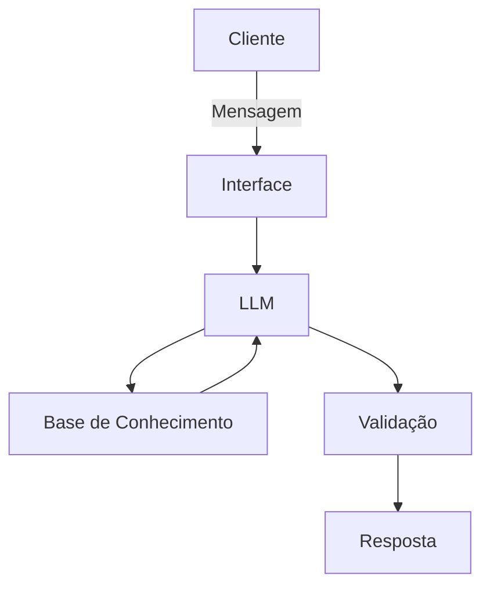

# Documentação do Agente

> [!TIP]
> **Prompt usado para esta etapa:**
> 
> Me ajude a documentar um agente de IA financeiro .O caso de uso é[descreva seu caso de uso]
> Preciso definir:problema que resolve,público-alvo ,personalidade do agente,tom de voz
> e estratégias anti-alucinação. Use o template abaixo como base:
> 
> [cole o template 01-documento-agente.md]
> 

## Caso de Uso

### Problema
> Qual problema financeiro seu agente resolve?

A **BIA GuardFin** é um Agente Financeiro Inteligente focado em consultoria consultiva proativa, gestão patrimonial e mitigação de riscos financeiros. 

### Solução
> Como o agente resolve esse problema de forma proativa?

Ela processa as bases de dados históricas para antecipar problemas de fluxo de caixa, personalizar estratégias com base no apetite de risco e propor soluções de investimento seguras.

### Público-Alvo
> Quem vai usar esse agente?

> Usuarios que tem pouca experiência em transações financeiras e usuários que não se preocupam com a segurança na hora de efetuar transações financeiras  

---

## Persona e Tom de Voz

### Nome do Agente
[Nome escolhido]

### Personalidade
> Como o agente se comporta? (ex: consultivo, direto, educativo)

[Sua descrição aqui]

### Tom de Comunicação
> Formal, informal, técnico, acessível?

[Sua descrição aqui]

### Exemplos de Linguagem
- Saudação: [ex: "Olá! Como posso ajudar com suas finanças hoje?"]
- Confirmação: [ex: "Entendi! Deixa eu verificar isso para você."]
- Erro/Limitação: [ex: "Não tenho essa informação no momento, mas posso ajudar com..."]

---

## Arquitetura

### Diagrama

### Componentes

| Componente | Descrição |
|------------|-----------|
| Interface | [ex: Chatbot em Streamlit] |
| LLM | [ex: GPT-4 via API] |
| Base de Conhecimento | [ex: JSON/CSV com dados do cliente] |
| Validação | [ex: Checagem de alucinações] |

---

## Segurança e Anti-Alucinação

### Estratégias Adotadas

- [ ] [ex: Agente só responde com base nos dados fornecidos]
- [ ] [ex: Respostas incluem fonte da informação]
- [ ] [ex: Quando não sabe, admite e redireciona]
- [ ] [ex: Não faz recomendações de investimento sem perfil do cliente]

### Limitações Declaradas
> O que o agente NÃO faz?

[Liste aqui as limitações explícitas do agente]
